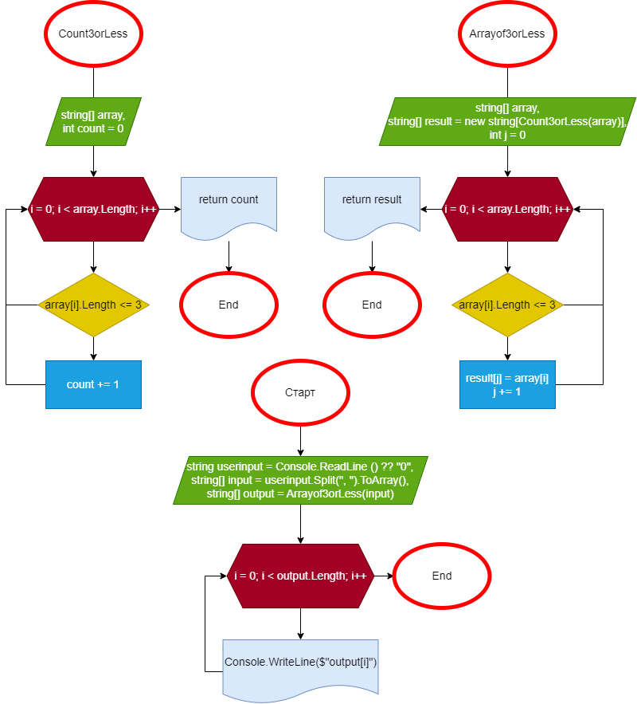

# Итоговая Проверочная Работа

## Общее

Программа разделена на три этапа.

1. Этап Подсчета
2. Этап Выбора
3. Этап Ввода и Вывода

## Этап Подсчета

Этап Подсчета составляет из себя метод названный **"Count3orLess"**.

В данном методе с помощью цикла for считаем количество слов в данном массиве, которые имеют длину в три или меньше, а потом возвращает это значение.

## Этап Выбора

Этап Выбора составляет из себя метод названный **"Arrayof3orLess"**

В данном методе мы создаем новый массив, длиной которой будет результат метода **Count3orLess** из данного массива. Потом, с помощью идентичного цикла for, добавляет все слова, которые имеют длину в три или меньше в новый массив, а потом возвращает это значение.

## Этап Ввода и Вывода

Этап Ввода и Вывода составляет из себя собственно ввод и вывод.

Мы говорим пользователю написать слова через запятую, а потом приводим пример, каким образом их вводить. После ввода строки *userinput*, мы составляем из него массив *input*, смотря по указанным запятым. Если после запятой не будет пробела, то программа посчитает это как одно слово.

Дальше, мы создаем новый массив *output*, значением которым будет метод **Arrayof3orLess** из массива *input*. И наконец, завершает работу программа цикл for, который показывает содержимое метода *output*.

## Блок-схема

Вот так выглядит блок-схема моей программы

